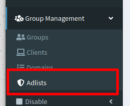
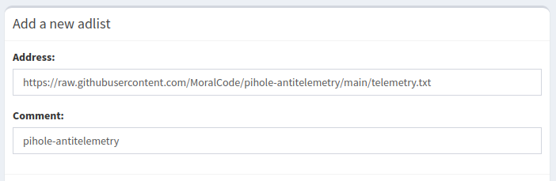

# pihole-antitelemetry
[Research](https://www.scss.tcd.ie/doug.leith/apple_google.pdf) shows Google collects 20x more data from Android than Apple collects from iOS. Block both using these pihole lists.

## Project Goals and FAQ

The purpose and goals of this blocklist are outlined in the [FAQ](FAQ.md#why-was-this-list-created)

## The lists
For a list of domains that should not break anything, use `telemetry-domains.txt`.

If you want to also block domains that are not well-tested, add `telemetry-domains_beta.txt` to the list. 

Domains that are known to break user-facing services or apps are moved to `telemetry-domains_borked.txt` for use at your own risk.

These lists are maintained with help from the community. Any efforts to help sort domains into the correct blocklists will help others better block non-consensual telemetry.

## Import blocklist

On the Pi-hole admin page, go under _Group management_ > _Adlists_ > _Add a new adlist_

You can add a new list either by URL or by local path:

- By URL: https://raw.githubusercontent.com/MoralCode/pihole-antitelemetry/main/telemetry-domains.txt
- By local path: `file:///local/path/to/blocklist.txt`.

> ( ! )  To apply the changes you need to run `pihole -g` or update your gravity list online: `http://<YOUR-PIHOLE_SERVER>/admin/gravity.php`

## Existing lists
- [NextDNS apple list](https://github.com/nextdns/metadata/blob/master/privacy/native/apple)
- [mischosts apple telemetry list](https://github.com/llacb47/mischosts/blob/master/apple-telemetry)
- https://decloudus.com/
- https://filterlists.com/
- https://github.com/crazy-max/WindowsSpyBlocker
- 
